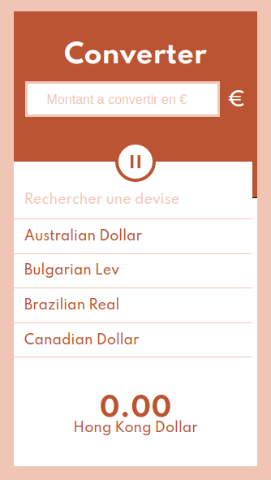

# Converter

## Table of contents

* What is Converter ?
* How does it work ?
* Stack

### What is Converter ?

Converter is a tool to convert an amount in euros to another currency.

### How does it work ?

Enter the amount and choose a currency into the list then the converted amount appears instantly.
You can enter the wanted currency in the search bar.

Enjoy your converter !

[https://seb-converter.netlify.app/](https://seb-converter.netlify.app)

### Stack
